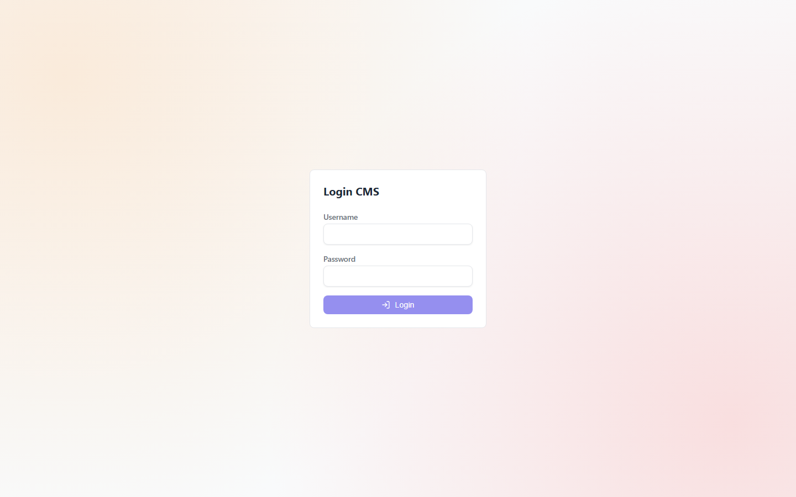
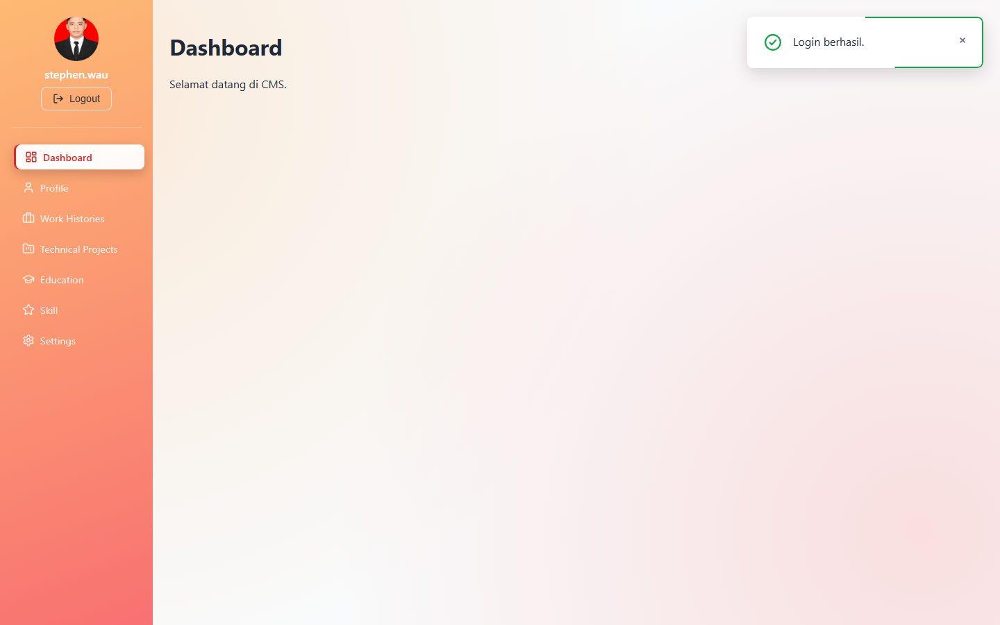
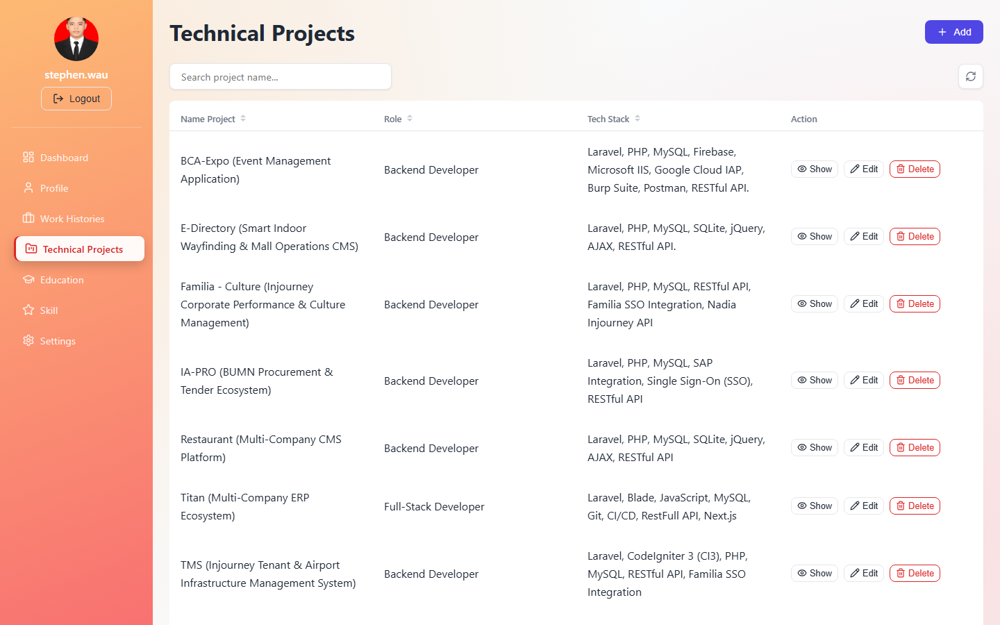
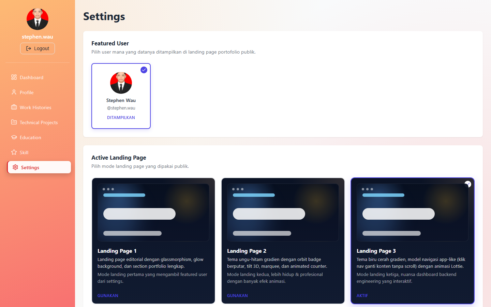
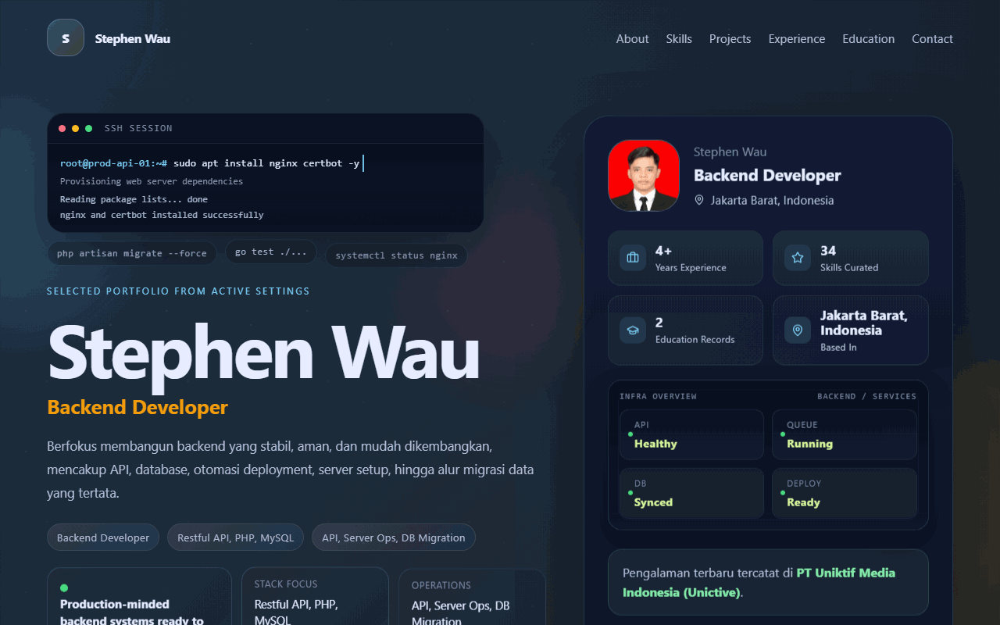
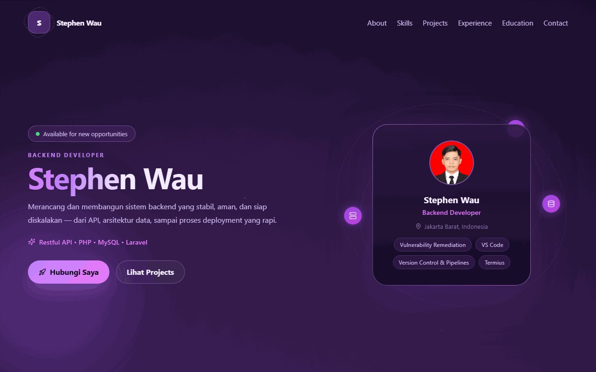
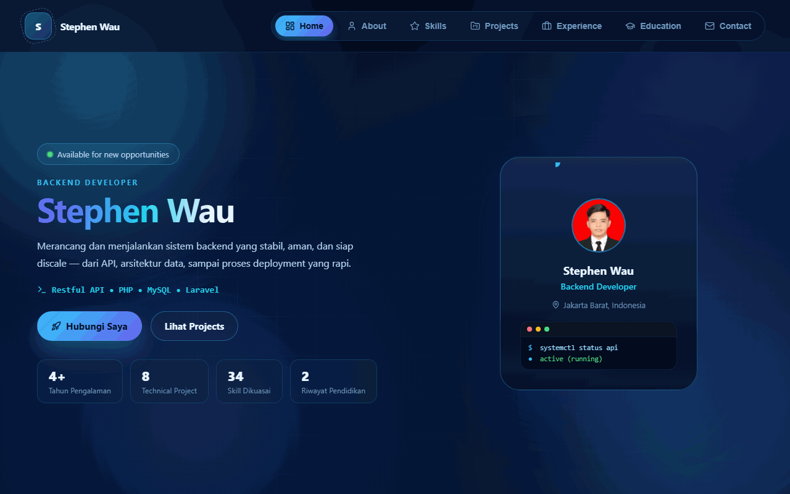

# Dynamic Portofolio

Full-stack personal portfolio — **Angular** (frontend) + **Go** (backend REST API) + **MySQL** (database) — with two rendering modes: fully dynamic (CMS-driven, live from DB) or fully static (hardcoded, deployable without a backend).

## Tech Stack


### Backend

| Layer      | Teknologi              | Versi   |
| ---------- | ------------------------ | ------- |
| Runtime    | Go                      | 1.26    |
| DB Driver  | go-sql-driver/mysql     | 1.8.1   |
| Auth       | golang-jwt/jwt          | 5.3.1   |
| Env Loader | joho/godotenv           | 1.5.1   |
| Crypto     | golang.org/x/crypto     | 0.54.0  |

### Frontend

| Layer         | Teknologi              | Versi   |
| ------------- | ------------------------ | ------- |
| Framework     | Angular                | 18.2    |
| Table         | ngx-datatable           | 21.0    |
| Rich Text     | Quill / ngx-quill       | 2.0 / 26.0 |
| Animation     | Lottie-web              | 5.13    |
| Icons         | lucide-angular          | 0.462   |
| Date Picker   | flatpickr               | 4.6     |
| Reactive Util | RxJS                    | 7.8     |
| Language      | TypeScript              | 5.5     |

## Features

**Public landing page** — 3 selectable themes, switchable from CMS Settings:

- **Landing Page 1** — editorial style, glassmorphism, glow background, full portfolio sections.
- **Landing Page 2** — purple-black gradient theme, 3D tilt orbit badge, marquee, animated counters.
- **Landing Page 3** — blue gradient theme, app-like tab navigation (click to switch section, no scroll), Lottie animation.

**Admin CMS** (`/admin-cms`) — protected by JWT login:

| Menu               | Route                          | Manages                                   |
| ------------------- | ------------------------------- | ------------------------------------------ |
| Dashboard           | `/admin-cms`                   | Overview after login                      |
| Profile              | `/admin-cms/profile`           | Name, position, contact, about-me, photo  |
| Work Histories       | `/admin-cms/work-histories`    | Job experience entries                    |
| Technical Projects   | `/admin-cms/technical-projects`| Showcased projects + attached files       |
| Education            | `/admin-cms/education`         | Education history                         |
| Skill                | `/admin-cms/skills`            | Soft / hard / software skills             |
| Settings             | `/admin-cms/settings`          | Featured user & active landing page       |

**Rendering modes** (`frontend/src/environments/environment.ts`):

- `useStaticData: false` — landing page fetches live data from `GET /api/public/portfolio`.
- `useStaticData: true` — landing page uses hardcoded data from `static-portfolio-data.ts` (no backend required — used for the GitHub Pages deployment). Pick which page shows via `staticLandingPage: 1 | 2 | 3`.

## Project Structure

```
backend/     Go REST API (main.go, internal/, migrations/, cmd/seed)
frontend/    Angular app (src/app/features/landing, admin-cms)
docs/        Screenshots & docs
```

## Getting Started

### 1. Setup MySQL

```sql
CREATE DATABASE dynamic_portofolio;
```

Copy `.env.example` to `backend/.env` and fill in your MySQL credentials + a `JWT_SECRET`.

### 2. Run migrations

```bash
cd backend
for f in migrations/*.sql; do mysql -u root dynamic_portofolio < "$f"; done
```

### 3. Seed an admin user

```bash
cd backend
go run ./cmd/seed
```

Credentials are hardcoded in `backend/cmd/seed/main.go` — check that file (don't reuse the default password if you deploy this publicly).

### 4. Run the backend

```bash
cd backend
go mod tidy
go run main.go
```

Runs on `http://localhost:8080` by default (or `$PORT` if set). Key env vars: `DB_USER`, `DB_PASSWORD`, `DB_HOST`, `DB_PORT`, `DB_NAME`, `DB_USE_TLS`, `FRONTEND_ORIGIN`, `JWT_SECRET`, `JWT_EXPIRY_HOURS`.

Login: `POST /api/auth/login` with `{"username", "password"}` → JWT. Send it via `Authorization: Bearer <token>` to protected endpoints (`GET /api/auth/me`, etc). Public landing data: `GET /api/public/portfolio` (no auth).

### 5. Run the frontend

```bash
cd frontend
npm install
npm run dev
```

Runs on `http://localhost:4400`. Update `apiUrl` in `frontend/src/environments/environment.ts` if your backend runs on a different port. CMS login: `http://localhost:4400/admin-cms/login`.

## Deployment

- **Frontend (static mode)** → GitHub Pages:
  ```bash
  cd frontend
  ng build --configuration production --base-href /dynamic-portofolio/
  npx angular-cli-ghpages --dir=dist/frontend/browser
  ```
- **Backend** → any Go-friendly host (e.g. Render free tier) — set the env vars above, build command `go build -o app .`, start command `./app`.
- **Database** → any managed MySQL (e.g. Aiven free tier) with `DB_USE_TLS=true`.

## Screenshots

### Admin CMS

| Login | Dashboard |
| ----- | --------- |
|  |  |

| Technical Projects | Settings (Active Landing Page) |
| ------------------- | -------------------------------- |
|  |  |

### Landing Pages

**Landing Page 1** — editorial, glassmorphism



**Landing Page 2** — purple-black gradient, animated orbit badge



**Landing Page 3** — blue gradient, app-like tab navigation


